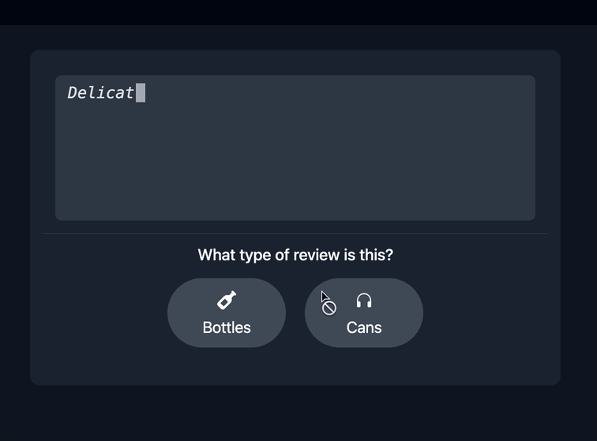
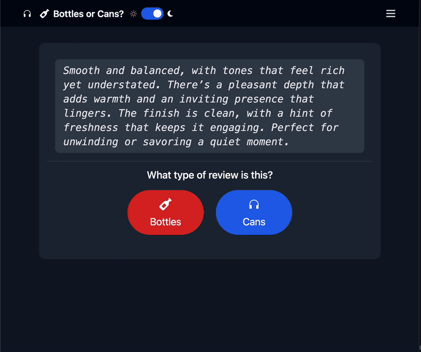
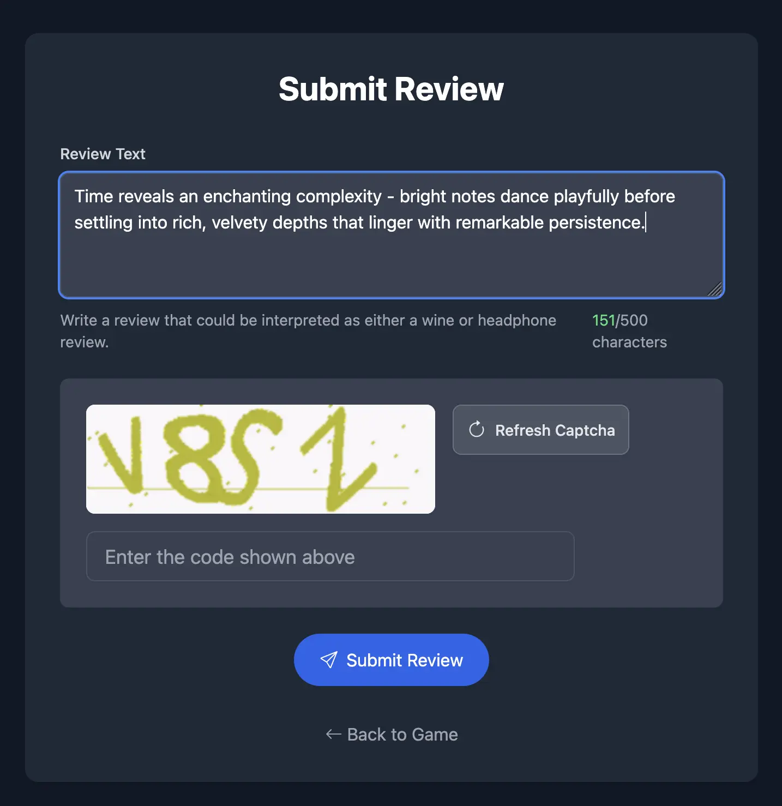
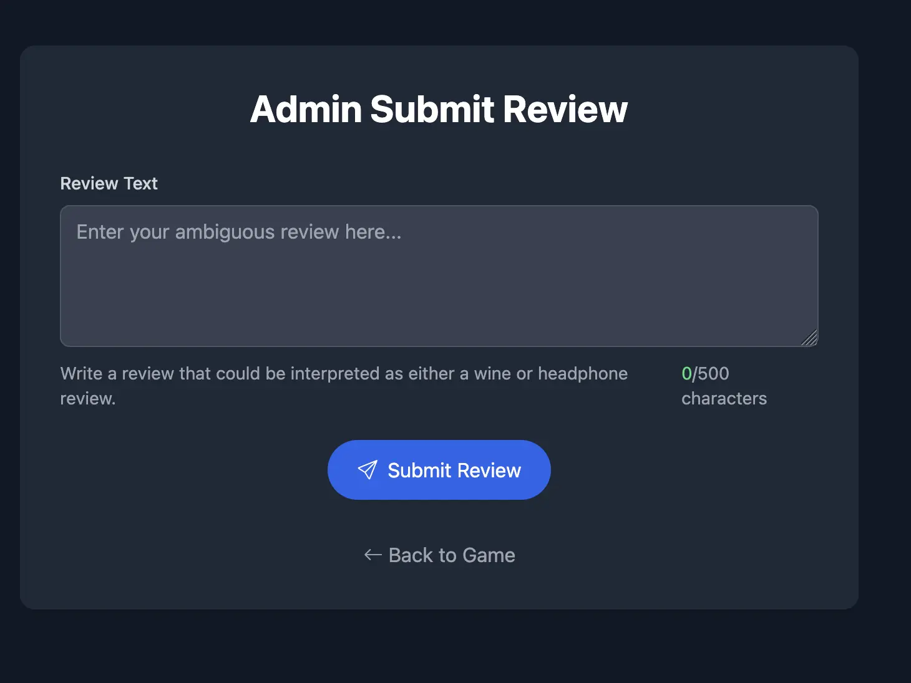
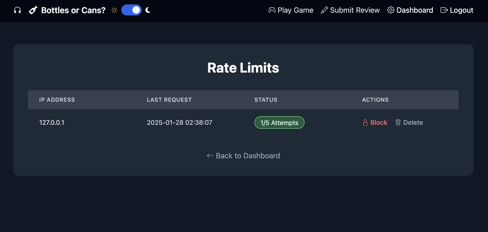
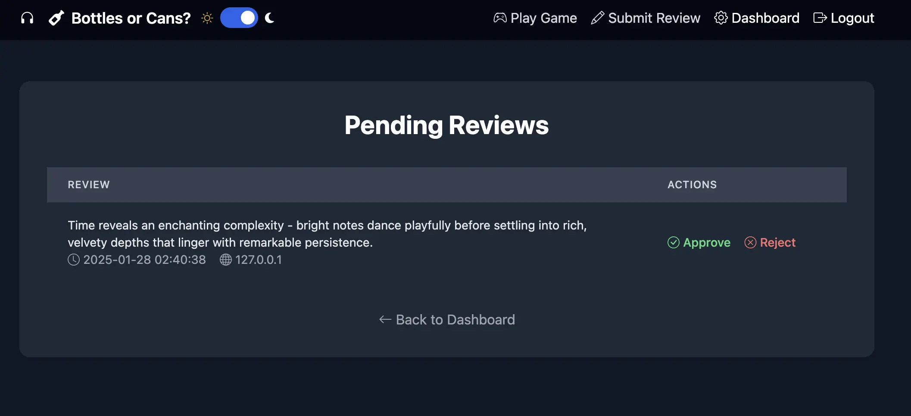
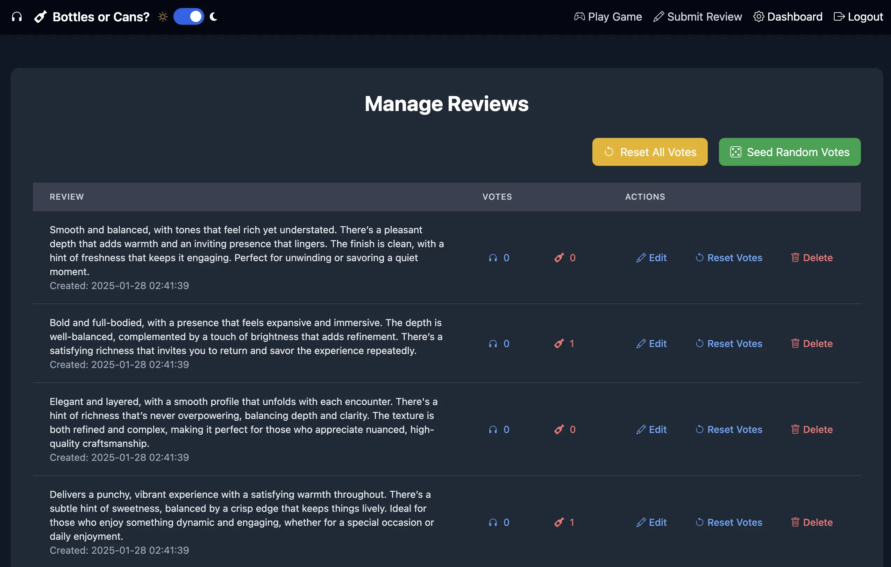

# Bottles or Cans

<p align="center">
  
</p>

If you like listening to music on headphones, and have read the reviews for them, you'll notice that often times they sound a lot like the reviews for a bottle of wine.  Let's make a game out of this and vote on which review is for a pair of headphones (cans) or a bottle of wine. 

## Overview
Bottles or Cans is a web application that allows users to submit reviews and vote on their preferences between two categories: headphones and wine. The application features an admin dashboard for managing reviews and users, as well as a user-friendly admin interface for submitting, viewing, and managing reviews.

## Requirements
To set up and run this application, you will need the following:

- Python 3.6 or higher
- Nodejs 22.13.1
- Tailwindcss
- Flask
- Flask-SQLAlchemy
- Pandas
- SQLite (or another database of your choice)

You can install the required Python packages using pip. It is recommended to use a virtual environment to manage dependencies.

## Features

### Core Features
- Interactive voting system for comparing headphone and wine reviews
- Real-time vote tracking and statistics
- Animated simulated typing effect for review presentation
- Custom modal dialogs for enhanced user interaction
- Mobile-responsive design using Tailwind CSS
- Dark mode support

### User Features
- Anonymous voting capability
- Review submission system with moderation
- User registration and authentication

### Admin Dashboard
- Comprehensive review management
  - Add, edit, and delete reviews
  - Moderate user-submitted reviews
  - Bulk import/export reviews from JSON files
- Analytics and Statistics
  - Vote distribution visualization

### Security & Anti-Abuse Features
- Rate limiting on votes and submissions
- IP-based abuse detection
- CAPTCHA integration for submissions
- Input sanitization and validation

### Technical Features
- RESTful API endpoints
- WebSocket support for real-time updates
- Caching system for improved performance
- Database optimization for large datasets
- Automated backup system
- Comprehensive logging system

### Customization
- Configurable voting thresholds
- Adjustable moderation settings

### Demos and Screenshots

No matter how long or short the review is, the text container that holds it will always be the correct size before the text fills it.



Dynamically resizing the text window and the text size when the browser window is resized.



Users can submit their own reviws, see how many characters they are towards a configurable limit, protected with a captcha.



Admins use the same endpoint without the captcha or rate limiting



User submissions are rate limited to protect against abuse.



Reviews submitted by users live in a pending review state saving their IP waiting for review.



Review management dashboard, with ability to seed vote counts, reset vote counts, and edit/delete reviews



## Setup Instructions

1. **Clone the Repository**
   ```bash
   git clone https://github.com/petecheslock/bottles_or_cans.git
   cd bottles_or_cans
   ```

2. **Create a Virtual Environment**
   ```bash
   python -m venv .venv
   source .venv/bin/activate
   ```

3. **Install Requirements**
   ```bash
   pip install -r requirements.txt
   ```

4. **Install Tailwind**
   ```bash
   npm i
   npm run build
   ```

5. **Start the Application**
   ```bash
   python run.py
   ```

   In the admin dashboard you can import initial reviews from a JSON file.

   The JSON file for importing reviews should follow this structure:
   ```json
   [
     {
       "text": "Review text here...",
       "votes_headphones": 0,
       "votes_wine": 0,
       "created_at": "2025-01-25 23:01:18.767771"  // optional
     }
   ]
   ```

   If you don't import reviews, you can add reviews manually through the admin interface or let users submit reviews (which you can moderate).

   You can export the reviews and vote counts from the admin dashboard.

## Running the Application

### Development
For development, set up your environment variables and run the development server:

```bash
export FLASK_APP=app
export FLASK_ENV=development
export FLASK_DEBUG=1
python run.py
```

The application will start on `http://127.0.0.1:5000/` by default.

### Production
For production deployment, we recommend using Gunicorn. First, install it:

```bash
pip install gunicorn
```

Set up your production environment variables:

```bash
export FLASK_APP=app
export FLASK_ENV=production
export FLASK_DEBUG=0
export SECRET_KEY=your-secure-secret-key
```

Then start the application with Gunicorn:

```bash
gunicorn -w 4 -b 0.0.0.0:5000 "run:app"
```

#### Environment Variables
- `FLASK_APP`: Set to "app" (required)
- `FLASK_ENV`: Set to "development" or "production"
- `FLASK_DEBUG`: Set to 1 for development, 0 for production
- `SECRET_KEY`: Required in production - set to a secure random string (`openssl rand -hex 32`)
- `DATABASE_URL`: Optional - defaults to SQLite, set to your database URL if using a different database

### Accessing the Application
Once running, you can access the application through your web browser:
- Development: `http://127.0.0.1:5000/`
- Production: Depends on your server configuration and domain setup

## Deployment

### Environment Setup

1. **Copy Environment Template**
   ```bash
   cp .env.example .env
   ```

2. **Configure Environment Variables**

   Required for Production:
   - `FLASK_ENV`: Set to "production"
   - `SECRET_KEY`: Set a secure random string
   - `DATABASE_URL`: Your database connection URL

   Optional Settings:
   - `CAPTCHA_LENGTH`: CAPTCHA complexity (default: 4)

3. **Install Production Dependencies**
   ```bash
   pip install -r requirements.txt
   ```

### Production Deployment

1. **Set Production Environment**
   ```bash
   export FLASK_APP=app
   export FLASK_ENV=production
   export FLASK_DEBUG=0
   ```

2. **Run with Gunicorn**
   ```bash
   gunicorn -w 4 -b 0.0.0.0:5000 "run:app"
   ```

   Adjust the number of workers (-w) based on your server's CPU cores.

3. **Initialize Database**
   When the application starts for the first time, the database will be setup with the admin user account 
   configured in the flask environment settings. You can then login to populate data in the database.

### Security Considerations

1. **Secret Key**
   - Generate a secure random key:
     ```bash
     python -c "import secrets; print(secrets.token_hex(32))"
     ```
   - Set this as your `SECRET_KEY` in .env

2. **Admin Credentials**
   - Set `ADMIN_USERNAME` and `ADMIN_PASSWORD` in your .env file
   - These will be used to create the admin account on first run
   - Navigate to /admin/login and use those credentials to access the management console

### Admin Access
The admin user is automatically created on first run using the credentials from your .env file.

## Contributing
Contributions are welcome! If you have suggestions for improvements or new features, feel free to open an issue or submit a pull request.

## License
This project is licensed under the MIT License - see the [LICENSE](LICENSE) file for details.

